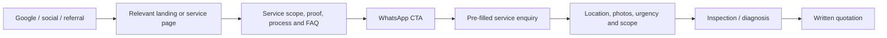

# Phase 1 — UX Structure and Wireframes

## Status

Complete baseline for owner review. This document translates the product specification into the approved build structure; it does not lock brand content, contact details, service areas, photography, warranty terms, or testimonials.

## Primary conversion flow



Every primary CTA opens WhatsApp. No public service price, starting price, price schema, or hidden price copy may be added.

## Sitemap and routes

| Route | Purpose | Build phase |
| --- | --- | --- |
| `/` | Conversion-led home page | Launch |
| `/solar-services-lahore` | Solar hub and child-service entry points | Launch |
| `/electrician-services-lahore` | Electrical hub | Launch |
| `/ac-services-lahore` | AC hub | Launch |
| `/projects` | Filterable project evidence | Launch |
| `/about` | Team, standards and coverage | Launch |
| `/contact` | WhatsApp-first contact journey | Launch |
| `/service-areas/[area]` | Only confirmed, operational areas | Later / controlled |
| `/privacy-policy` | Privacy information | Launch |
| `/terms` | Website terms | Launch |

Individual service URLs will be created in Phase 3 after final service-list approval. Their page template is defined below.

## Global wireframe

### Desktop header

`Logo | Home | Solar | Electrical | AC | Projects | About | Contact | WhatsApp CTA`

- 80px high; transparent/light over the hero, solid after scrolling.
- Solar appears first and receives the strongest service emphasis.
- WhatsApp CTA is always visible, labelled, and opens a general enquiry message.

### Mobile header

`Logo | Menu | WhatsApp`

- 64px high and sticky from page load.
- Menu opens an accessible navigation panel; Escape, outside click, and every selected link close it.
- Persistent WhatsApp action must not cover content, controls, or browser chrome.

### Footer

Business statement, services, company links, confirmed service areas, WhatsApp/phone/email/hours, legal links and optional map only after public-address confirmation.

## Page wireframes

### 1. Home

```text
[Sticky Header]
[Hero: Lahore proposition | WhatsApp | Explore services | project/team image]
[Trust strip: substantiated proof points]
[Three service cards: Solar (featured), Electrical, AC]
[Solar spotlight + project proof + consultation CTA]
[Why choose us: six evidence-led points]
[How it works: select > share > inspect > quote > complete > support]
[Six projects]
[Confirmed service areas]
[Genuine testimonials]
[FAQ: 5–8 high-intent questions]
[Final WhatsApp CTA + call alternative]
[Footer]
```

Desktop: hero is a balanced two-column layout. Mobile: copy, CTA pair, then image in one column. Sections use 96px / 64px / 48px vertical padding for desktop / tablet / mobile.

### 2. Service hub

```text
[Header]
[Service hero: service + Lahore | benefit | WhatsApp | image]
[Problems solved / customer types]
[Child service cards]
[Working process]
[Relevant projects]
[Safety, quality and warranty explanation]
[Service-specific FAQ]
[Related services]
[Final WhatsApp CTA]
[Footer]
```

### 3. Individual service detail

```text
[Breadcrumb + Header]
[Hero: service + Lahore | outcome | WhatsApp | image]
[Who this is for / service summary]
[What is included and exclusions]
[Common warning signs]
[Assessment > quote > work > testing > handover]
[Supported materials / systems]
[Why choose us]
[Related project evidence]
[Unique FAQ]
[Final WhatsApp CTA carrying service + page URL]
[Footer]
```

### 4. Projects

```text
[Header]
[Title + evidence-led introduction]
[Accessible filters: All | Solar | Electrical | AC]
[Project grid: image, service, Lahore area, scope/result]
[WhatsApp CTA]
[Footer]
```

### 5. About

```text
[Header]
[Hero]
[Experience / team capability]
[Service standards and safety approach]
[How we work]
[Coverage statement]
[CTA]
[Footer]
```

### 6. Contact

```text
[Header]
[WhatsApp-first hero and phone alternative]
[Service selector + area selector]
[Business hours and confirmed coverage]
[Optional short form with consent]
[Map only if public address is approved]
[Footer]
```

## Responsive rules to carry into UI development

- Mobile (320–767): one column, 16px gutters, full-width primary CTA where useful.
- Tablet (768–1023): two-column cards when content permits, 24px gutters.
- Desktop (1024+): 12-column grid, maximum 1200px content width.
- All CTA targets are at least 44px high. Keyboard focus, logical tab order and reduced motion are mandatory.
- The WhatsApp action is explicit text, never an icon-only primary action.

## WhatsApp CTA map

| Context | CTA label | Message context |
| --- | --- | --- |
| Header/footer | WhatsApp us | General Lahore enquiry |
| Solar hub/card/detail | Request solar consultation | Solar service name |
| Electrical hub/card/detail | Get electrical help | Electrical issue/service |
| AC hub/card/detail | Book AC assistance | AC service name |
| Project card | Discuss a similar project | Project service type |
| Contact page | Start WhatsApp enquiry | Chosen service and area |

The final number is a single environment/config value. All messages include area placeholder and, where practical, the source page URL.

## Phase 1 acceptance check

- [x] Home, service hub, detail, projects, about and contact low-fidelity structures defined.
- [x] Desktop and mobile navigation behaviour defined.
- [x] WhatsApp conversion path and CTA contexts mapped.
- [x] Content model and missing-content inventory prepared in companion documents.
- [ ] Owner approval of page inventory, service list and initial wireframes.
